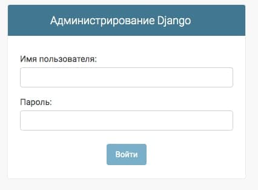
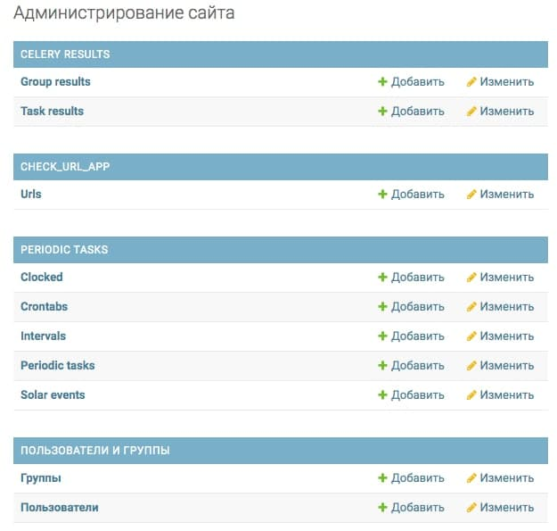
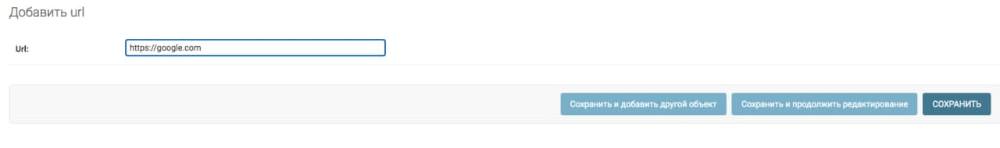
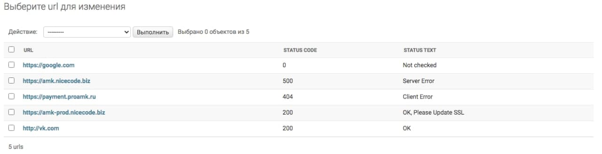
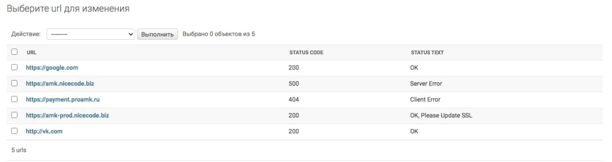

# Web-Application for pass test task on "Junior-Python-Web-Dev"
## Task

Implement a Django server to check the availability of listed sites using celery.
Description:
1. Create a Django server with an admin panel, from which you can run tasks to check the availability of sites from the passed list.
2. Tasks should be performed by means of Celery-Worker running in parallel.
3. Redis and RabbitMQ can be used as the resulting Backend for celery-result and message broker. But not necessarily if there is a desire to use something else.
4. Comments on the code, demonstrating your understanding of what is happening, are welcome.

## Install and setup application

**bash**
```
cd ~/.
git clone https://github.com/shaggy-axel/url_checker.git
cd url_checker/
touch .env
```
**.env**
```
# if is production, set TRUE, else FALSE
IS_PROD=TRUE

# Env for DataBase PostgreSQL
POSTGRES_DB=<database_name>
POSTGRES_USER=<username>
POSTGRES_PASSWORD=<password>

# Env for Celery
CELERY_BROKER_URL=redis://redis:6379

# Env for Redis
REDIS_HOST=redis
REDIS_PORT=6379
```
env_sample file also can help you

**bash**
```
docker-compose up -d
docker exec -it url_checker_web bash
. venv/bin/activate
python src/manage.py createsuperuser
```
Write your username, e-mail(optional), password for admin panel

## How to Use Admin Panel
Now you can go to your [web-admin-page](http://localhost:8080/admin)
<p>
  LogIn<br>
  <br>
  Select Add ( ➕ Добавить) in "Urls" in CHECK_URL_APP<br>
  <br>
  Write your link and click "Save" (Сохранить)<br>
  <br>
  Now, you can see your web-site in list, wait for 15 seconds and update web-page<br>
  <br>
  ✅ Done<br>
  Your web-site status code 200 - is OK<br>
  <br>
</p>
